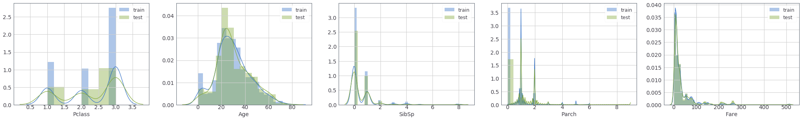
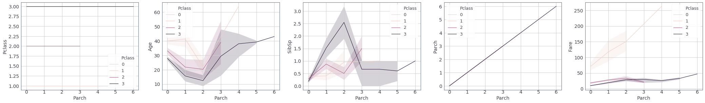
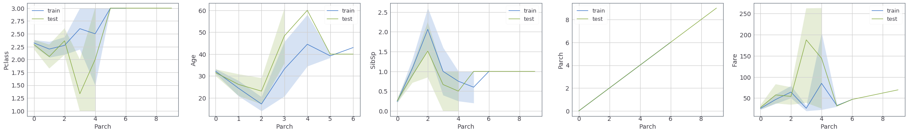

# Exploratory Data Analysis

---

### class handyML.Exploratory_data_analysis.**Overview**()

该类主要用来探索数据的整体分布。

---

#### **check_missing_data** *(data)*

检查数据中的缺失值

**参数：**

- **data : *pandas.DataFrame***

  输入数据。

**返回：**

- **res : *pandas.DataFrame***

```python
from handyML.Exploratory_data_analysis import Overview
from handyML.tests import load_data

train = load_data("train_regression")
Overview.check_missing_data(train)
```

<table border="1" class="dataframe">
  <thead>
    <tr style="text-align: right;">
      <th></th>
      <th>Total</th>
      <th>Percent</th>
      <th>Types</th>
    </tr>
  </thead>
  <tbody>
    <tr>
      <th>PassengerId</th>
      <td>0</td>
      <td>0.000000</td>
      <td>int64</td>
    </tr>
    <tr>
      <th>Survived</th>
      <td>0</td>
      <td>0.000000</td>
      <td>int64</td>
    </tr>
    <tr>
      <th>Pclass</th>
      <td>0</td>
      <td>0.000000</td>
      <td>int64</td>
    </tr>
    <tr>
      <th>Name</th>
      <td>0</td>
      <td>0.000000</td>
      <td>object</td>
    </tr>
    <tr>
      <th>Sex</th>
      <td>0</td>
      <td>0.000000</td>
      <td>object</td>
    </tr>
    <tr>
      <th>Age</th>
      <td>177</td>
      <td>19.865320</td>
      <td>float64</td>
    </tr>
    <tr>
      <th>SibSp</th>
      <td>0</td>
      <td>0.000000</td>
      <td>int64</td>
    </tr>
    <tr>
      <th>Parch</th>
      <td>0</td>
      <td>0.000000</td>
      <td>int64</td>
    </tr>
    <tr>
      <th>Ticket</th>
      <td>0</td>
      <td>0.000000</td>
      <td>object</td>
    </tr>
    <tr>
      <th>Fare</th>
      <td>0</td>
      <td>0.000000</td>
      <td>float64</td>
    </tr>
    <tr>
      <th>Cabin</th>
      <td>687</td>
      <td>77.104377</td>
      <td>object</td>
    </tr>
    <tr>
      <th>Embarked</th>
      <td>2</td>
      <td>0.224467</td>
      <td>object</td>
    </tr>
  </tbody>
</table>


#### **plot_feature_distribution** *(df, y_features, x_feature=None, hue=None, columns=2)*

画m×n的折线图/密度图。

当传入的df为一个pd.DataFrame对象时，每一个图表仅绘制该对象的数据信息。

当df为一个字典时(字典的键应为其对应的字典中的数据的标签，如：{'train':df_train,'test':df_test})，每个图表绘制字典中存储的所有的数据信息。

当x_feature为空时，绘制y_features中每一个feature的密度图；否则绘制以x_feature为横轴的折线图。

**参数：**

   - **df :  *pandas.DataFrame / dict***

        输入数据。

        若类型为`dict`，则格式应为`{标签名：数据}`

   - **y_features : *list***

        特征列表，绘制密度图时每张图中的特征；绘制折线图时纵坐标表示的特征。

   - **x_feature : *string, default=None***

         绘制折线图时横坐标表示的特征。

   - **hue : *string, default=None***

        分类目标特征，当不为空时将按该特征中的类别绘制y_features中特征的密度图/折线图。

   - **columns :  *int, default=2***

        每一行绘制的图表数量。

```python
from handyML.Exploratory_data_analysis import Overview
from handyML.tests import load_data

train = load_data("titanic_train")
test = load_data("titanic_test")

features = [_ for _ in train.columns if _ not in ['Survived', 'Name', 'Ticket', 'Sex', 'Cabin', 'Embarked', 'PassengerId']]
```

```python
#绘制train和test的密度图
Overview.plot_feature_distribution({'train':train,'test':test}, features, columns=5)
```



```python
#绘制以day为横坐标的折线图，并且按照favorite分开，每行5幅图
Overview.plot_feature_distribution(train, features, x_feature='day', hue='favorite', columns=5)
```



```python
#绘制train和test以day为横坐标的折线图
Overview.plot_feature_distribution({'train':train,'test':test}, features, x_feature='day', columns=5)
```



